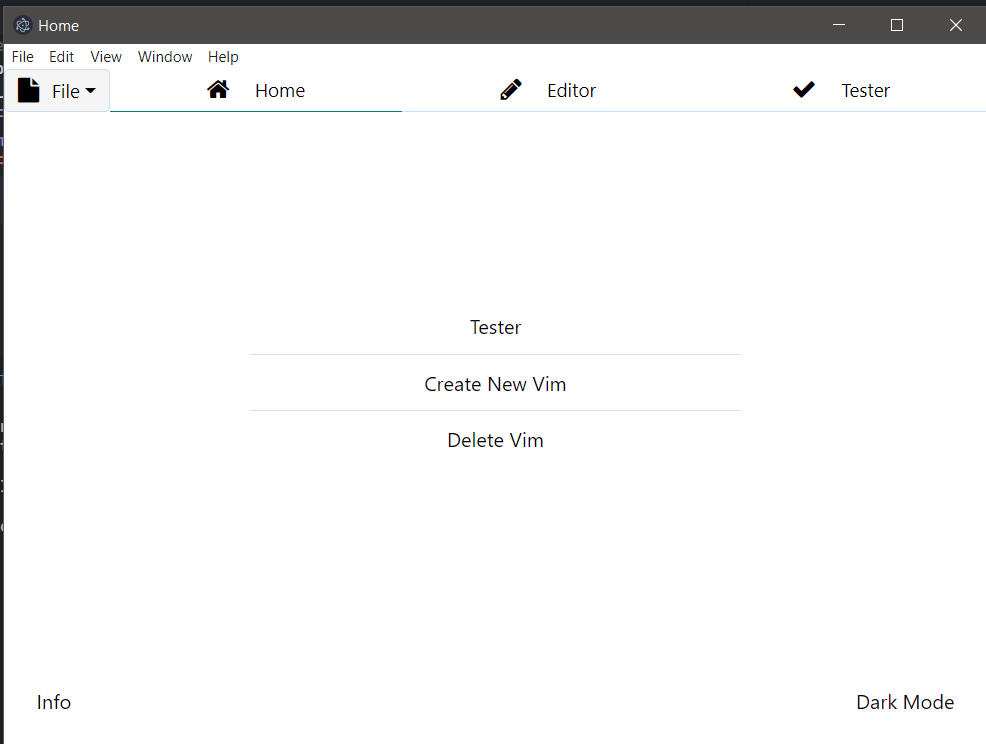
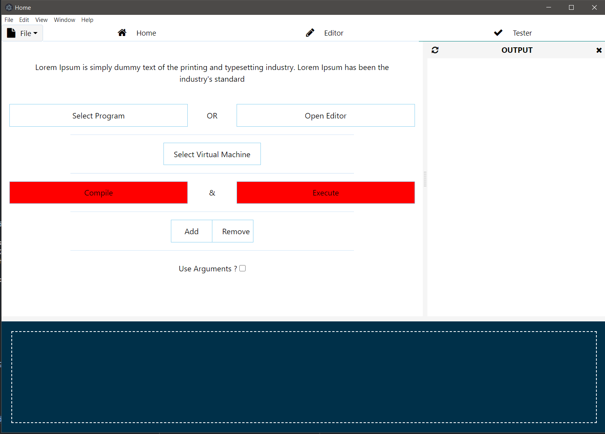
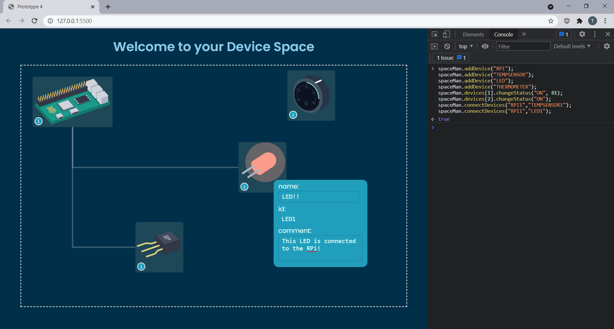

# Smart Space Visualizer

## About

An electron app to emulate an Internet of Things (IoT) space. Made as part of the research paper "..." by "..." at Northeastern Illinois University.

## The Project Directory

The project is split into various folders based on their functionality.

- `/`

The root directory contains the starting point for the Electron app, including the package information and commands to start the application using `npm`. The file `main.js`

- `/assets/`

The assets directory

- `/components/`

The components directory

- `/Pages/`

  The pages directory

  - `/editor/`

  The editor sub-directory within pages

  - `/index/`

  The index sub-directory within pages

  - `/spaceman-assets/`

  The spaceman-assets sub-directory within pages contain the code for the smart space visualizer's "space manager".
  The space manager contains the webpage with illustrations for representing the smart devices, allowing the user to visualize the smart space and interact with them.
  The current version of the space manager does not allow the user to connect smart devices with each other, or change their statuses.
  The user can (by interacting with the GUI) add comments to each device and modify the name given to it, and drag the devices around, etc.
  (Although, if they are familiar with the API/functions provided by SpaceManager, they can manipulate the devices in all sorts of way using console commands)

  Within the directory you have a self-contained HTML page, JS files, and CSS required to use the visualizer via browser yourself if you serve that folder to a browser.

  - `/tester/`

  The tester sub-directory within pages

### Screenshots

- The app - home screen
  

- Code editor within the app
  

- Tester tab: Uninitialized
  

- Tester tab: Adding and running code on emulated devices in smart space
  

- Space Manager running in the browser
  

## How to install and run the IoT Emulator

### Package/tools/frameworks needed

- NodeJS: [Link](https://nodejs.org/en/). For building & running the emulator GUI.
- Vagrant: [Link](https://www.vagrantup.com/downloads). For creating the virutal machines for operating systems like RaspbianOS that the emulator interfaces with.
- RaspbianOS image: [Link](https://www.raspberrypi.org/software/operating-systems/). The image for the OS that vagrant loads and interfaces with.
- ssh tools?
- C++ compiler??

### Steps to install & run

1. Download and install NodeJS and Vagrant
2. Clone the code from this repo using: `git clone https://github.com/sebinsuresh/smart-device-emulator.git`
3. Download the Raspbian OS image file.
4. ...

## Contact US

- A-Khaled@neiu.edu Ahmed Khaled, CS department at Northeastern Illinois University.
- M-Ashfaq@neiu.edu Mohammed Ashfaq, Northeastern Illinois University.
- sputhenthara@neiu.edu Sebin Puthenthara Suresh, Northeastern Illinois University.

### Read more about this project: [Link to paper](...)
